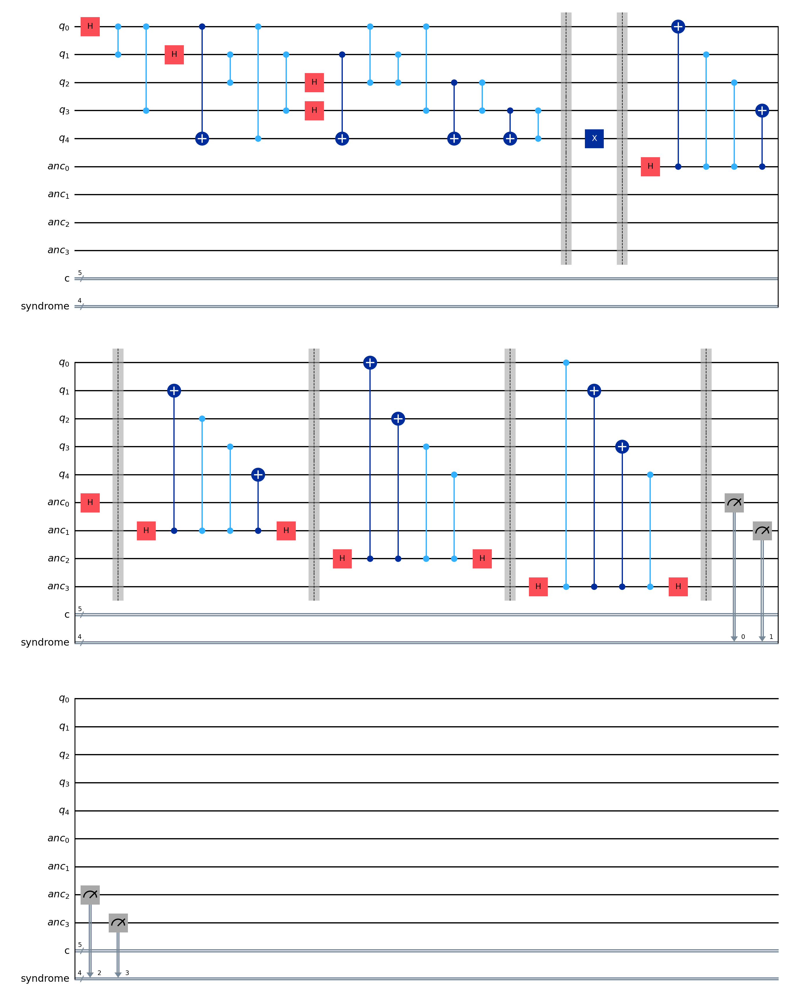

# 5-qubit-stabilizer-QEC

## Description

This project implements the 5-qubit quantum error correction code using Qiskit. The code encodes one logical qubit across five physical qubits to protect against any single-qubit error, including bit flips (\(X\)), phase flips (\(Z\)), or their combination (\(XZ\)). Stabilization is achieved through four stabilizer operators, and syndrome measurements identify and locate errors. The implementation includes encoding, an example error, stabilizer measurements, and simulation.

## Code Structure

The main script constructs a quantum circuit with the following steps:

1. **Encoding**: The logical qubit on `q0` is encoded into the logical zero state $|0_L \rangle$ using 5 physical qubits via Hadamard (`H`), Pauli-\(Z\) (`Z`), CNOT (`CX`), and controlled-\(Z\) (`CZ`) gates (see [Wikipedia: Five-qubit error correcting code](https://en.wikipedia.org/wiki/Five-qubit_error_correcting_code)). A commented section allows verification of the statevector.

2. **Error Injection**: A single \(X\) error is applied to `q4` as an example. This can be modified to test other error types.

3. **Stabilizer Measurement**: Four ancilla qubits measure the stabilizers:
   - \(S1 = XZZXI\)
   - \(S2 = IXZZX\)
   - \(S3 = XIXZZ\)
   - \(S4 = ZXIXZ\)
   Each stabilizer is implemented with Hadamard and controlled gates, followed by measurement into a syndrome register.

## Circuit Diagram

The full circuit, including encoding, error, and stabilizer measurements, is saved as:

  
   <i></i>

## Results

Syndrome measurement within the .ipynb file yields "yndrome measurements: {'1100 00000': 1024}". Qiskit uses a reversed indexing style to the error-diagnosis table on the wikipedia page, so our actual syndrome measurement reads 0011, correctly diagnosing the error as a bit flip error on q4.
